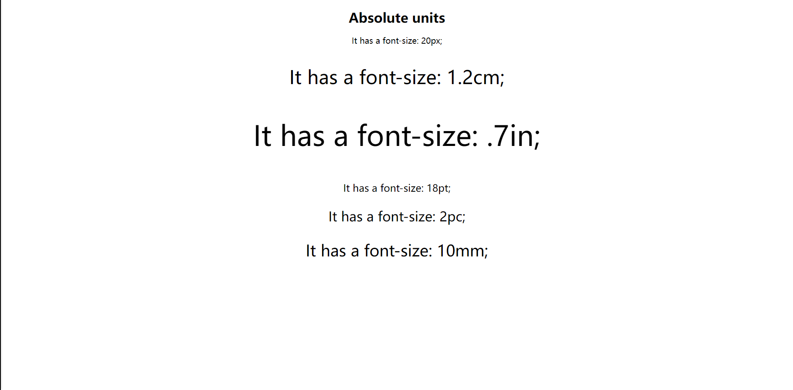
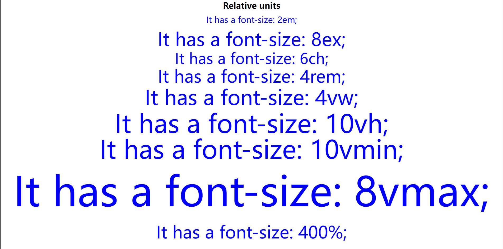

# CSS 单位 （绝对长度和相对长度）

最近在开发响应式网页的时候，字体大小总是影响效果，原因就是使用了绝对长度单位导致的，因此让我们一起来了解一下CSS中有哪些单位是绝对长度、相对长度的，在开发中又如何使用呢！

## 绝对长度

下列‎这些是固定长度的单位，使用绝对单位表示的长度将显示为与该大小完全相同。不建议在屏幕上使用，因为屏幕的大小变化太大。因此，当输出介质已知时，应使用绝对单位，例如打印布局。‎

‎当项目中不考虑响应能力时，绝对单位很有用。它们对响应式网站不太有利，因为它们不会在屏幕更改时缩放。‎

‎通常，绝对长度始终被视为相同的大小。绝对长度单位的表格如下：‎

| cm   | 厘米                       |
| ---- | -------------------------- |
| mm   | 毫米                       |
| in   | 英寸 (1in = 96px = 2.54cm) |
| px * | 像素 (1px = 1/96th of 1in) |
| pt   | 点 (1pt = 1/72 of 1in)     |
| pc   | 派卡 (1pc = 12 pt)         |

***** 像素（px）是相对于观看设备的。对于低 dpi 的设备，1px 是显示器的一个设备像素（点）。对于打印机和高分辨率屏幕，1px 表示多个设备像素。

```html
<!DOCTYPE html>
<html>

<head>
    <style>
        body {
            text-align: center;
        }
    </style>
</head>

<body>
    <h1> Absolute units </h1>
    <p style="font-size: 20px;"> It has a font-size: 20px; </p>
    <p style="font-size: 1.2cm;"> It has a font-size: 1.2cm; </p>
    <p style="font-size: .7in;"> It has a font-size: .7in; </p>
    <p style="font-size: 18pt;"> It has a font-size: 18pt; </p>
    <p style="font-size: 2pc;"> It has a font-size: 2pc; </p>
    <p style="font-size: 10mm;"> It has a font-size: 10mm; </p>
</body>

</html>
```



## 相对长度

‎相对单位非常适合设置响应式网站的样式，因为它们相对于窗口大小或父级进行缩放。它们指定长度，该长度相对于另一个 length 属性。‎

‎根据设备的不同，如果屏幕的大小变化太大，则相对长度单位是最好的，因为它们在不同的渲染媒体之间可以更好地缩放。我们可以使用相对单位作为响应单位的默认值。它有助于我们避免更新不同屏幕尺寸的样式。‎

‎相对长度单位的表格如下：‎

| 单位 | 描述                                                         |
| :--- | :----------------------------------------------------------- |
| em   | 相对于元素的字体大小（font-size）（2em 表示当前字体大小的 2 倍） |
| ex   | 相对于当前字体的 x-height(极少使用)                          |
| ch   | 相对于 "0"（零）的宽度                                       |
| rem  | 相对于根元素的字体大小（font-size）                          |
| vw   | 相对于视口*宽度的 1%                                         |
| vh   | 相对于视口*高度的 1%                                         |
| vmin | 相对于视口*较小尺寸的 1％                                    |
| vmax | 相对于视口*较大尺寸的 1％                                    |
| %    | 用于设置元素的宽度时，它总是相对于其直接父元素的大小。如果没有定义的父级，则默认情况下 body 会被视为父级。 |

***** 视口（Viewport）= 浏览器窗口的尺寸。如果视口为 50 厘米宽，则 1vw = 0.5 厘米。

因此，我们要开发响应式网站，一般常用em、rem两个单位：

- em总是相对于它的直接父级的字体大小，如父元素字体为10px，则1em=10px，2em=20px；
- rem总是相对于根元素的字体大小，即html元素，而跟父元素的字体大小无关，如根元素字体10px，直接父元素为20px时，1rem=10px，而不是20px；

```html
<!DOCTYPE html>
<html>

<head>
    <style>
        html {
            /* 修改此属性查看rem的变化 */
            font-size: 20px;
        }

        body {
            text-align: center;
            /* 修改此属性查看em的变化 */
            font-size: 20px;
        }

        p {
            line-height: 0.1cm;
            color: blue;
        }
    </style>
</head>

<body>
    <h1> Relative units </h1>
    <p style="font-size: 2em;"> It has a font-size: 2em; </p>
    <p style="font-size: 8ex;"> It has a font-size: 8ex; </p>
    <p style="font-size: 6ch;"> It has a font-size: 6ch; </p>
    <p style="font-size: 4rem;"> It has a font-size: 4rem; </p>
    <p style="font-size: 4vw;"> It has a font-size: 4vw; </p>
    <p style="font-size: 10vh;"> It has a font-size: 10vh; </p>
    <p style="font-size: 10vmin;"> It has a font-size: 10vmin; </p>
    <p style="font-size: 8vmax;"> It has a font-size: 8vmax; </p>
    <p style="font-size: 400%;"> It has a font-size: 400%; </p>
</body>

</html>
```



## 文档下载

此文章系原创，转载请附上链接，抱拳...

此文档提供markdown源文件下载，请去我的码云仓库进行下载... [下载文档](https://gitee.com/zhangqianchun/Share)

若本文对你有用，请不要忘记给我的点个Star哦....


