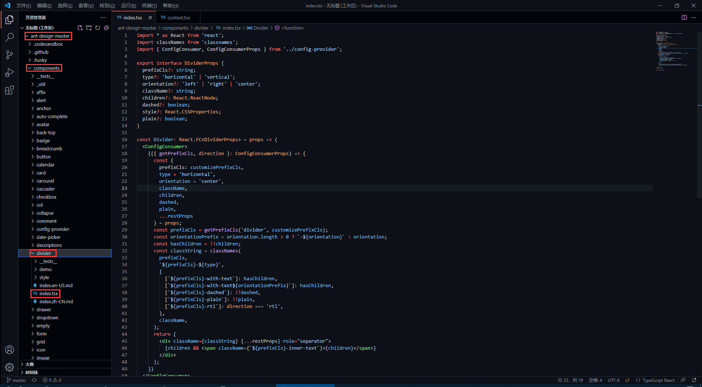

# 如何基于 React 封装一个组件

## 前言

很多小伙伴在第一次尝试封装组件时会和我一样碰到许多问题，比如人家的组件会有 color 属性，我们在使用组件时传入组件文档中说明的属性值如 primary ，那么这个组件的字体颜色会变为 primary 对应的颜色，这是如何做到的？还有别人封装的组件类名都有自己独特的前缀，这是如何处理的呢，难道是 css 类名全部加上前缀吗，这也太麻烦了！

如果你正在困惑这些问题，你可以看看这篇文章。

我会参照 [antd的divider组件](https://ant.design/components/divider-cn/#components-divider-demo-horizontal) 来讲述如何基于React封装一个组件，以及解答上述的一些问题，请耐心看完！

## antd 是如何封装组件的

### 仓库地址

- antd 仓库地址：https://github.com/ant-design/ant-design
- divider 组件在下图对应目录下 (代码我会拷贝过来，感兴趣的还是可以去克隆一下仓库)



### divider 组件源代码

antd 的源码使用了 TypeScript 语法，因此不了解语法的同学要及时了解哦！

```tsx
import * as React from 'react';
import classNames from 'classnames';
import { ConfigConsumer, ConfigConsumerProps } from '../config-provider';

export interface DividerProps {
    prefixCls?: string;
    type?: 'horizontal' | 'vertical';
    orientation?: 'left' | 'right' | 'center';
    className?: string;
    children?: React.ReactNode;
    dashed?: boolean;
    style?: React.CSSProperties;
    plain?: boolean;
}

const Divider: React.FC<DividerProps> = props => (
    <ConfigConsumer>
        {({ getPrefixCls, direction }: ConfigConsumerProps) => {
            const {
                prefixCls: customizePrefixCls,
                type = 'horizontal',
                orientation = 'center',
                className,
                children,
                dashed,
                plain,
                ...restProps
            } = props;
            const prefixCls = getPrefixCls('divider', customizePrefixCls);
            const orientationPrefix = orientation.length > 0 ? `-${orientation}` : orientation;
            const hasChildren = !!children;
            const classString = classNames(
                prefixCls,
                `${prefixCls}-${type}`,
                {
                    [`${prefixCls}-with-text`]: hasChildren,
                    [`${prefixCls}-with-text${orientationPrefix}`]: hasChildren,
                    [`${prefixCls}-dashed`]: !!dashed,
                    [`${prefixCls}-plain`]: !!plain,
                    [`${prefixCls}-rtl`]: direction === 'rtl',
                },
                className,
            );
            return (
                <div className={classString} {...restProps} role="separator">
                    {children && <span className={`${prefixCls}-inner-text`}>{children}</span>}
                </div>
            );
        }}
    </ConfigConsumer>
);

export default Divider;

```

### 如何暴露组件属性

在源码中，最先看到的是以下内容，这些属性也就是divider组件所暴露的属性，我们可以 `<Divider type='vertical' />` 这样来传入 type 属性，那么 divider 分割线样式就会渲染为垂直分割线，是不是很熟悉！

```tsx
export interface DividerProps { // interface 是 TypeScript 的语法
    prefixCls?: string;
    type?: 'horizontal' | 'vertical'; // 限定 type 只能传入两个值中的一个
    orientation?: 'left' | 'right' | 'center';
    className?: string;
    children?: React.ReactNode;
    dashed?: boolean;
    style?: React.CSSProperties;
    plain?: boolean;
}
```

在上面的属性中，我们还发现 className 和 style是比较常见的属性，这代表我们可以 `<Divider type='vertical' className='myClassName' style={{width: '1em'}} />` 这样使用这些属性。

### 如何设置统一类名前缀

我们知道，antd 的组件类名会有他们独特的前缀 `ant-`，这是如何处理的呢？继续看源码。

```tsx
<ConfigConsumer>
    {({ getPrefixCls, direction }: ConfigConsumerProps) => {
        const {
            prefixCls: customizePrefixCls,
            type = 'horizontal',
            orientation = 'center',
            className,
            children,
            dashed,
            plain,
            ...restProps
        } = props;
        const prefixCls = getPrefixCls('divider', customizePrefixCls);
```

从源码中，我们发现 prefixCls ，这里是通过 getPrefixCls 方法生成，再看看 getPrefixCls 方法的源码，如下。

```tsx
export interface ConfigConsumerProps {
  ...
  getPrefixCls: (suffixCls?: string, customizePrefixCls?: string) => string;
  ...
}

const defaultGetPrefixCls = (suffixCls?: string, customizePrefixCls?: string) => {
  if (customizePrefixCls) return customizePrefixCls;

  return suffixCls ? `ant-${suffixCls}` : 'ant';
};
```

不难发现此时会生成的类名前缀为  `ant-divider` 。

### 如何处理样式与类名

我们封装的组件肯定是有预设的样式，又因为样式要通过类名来定义，而我们传入的属性值则会决定组件上要添加哪个类名，这又是如何实现的呢？下面看源码。

```tsx
import classNames from 'classnames';

const classString = classNames(
    prefixCls,
    `${prefixCls}-${type}`,
    {
        [`${prefixCls}-with-text`]: hasChildren,
        [`${prefixCls}-with-text${orientationPrefix}`]: hasChildren,
        [`${prefixCls}-dashed`]: !!dashed,
        [`${prefixCls}-plain`]: !!plain,
        [`${prefixCls}-rtl`]: direction === 'rtl',
    },
    className,
);
return (
    <div className={classString} {...restProps} role="separator">
        {children && <span className={`${prefixCls}-inner-text`}>{children}</span>}
    </div>
);
```

我们发现，它通过 classNames 方法（[classNames是React处理多类名的组件](https://www.npmjs.com/package/classnames)）定义了一个所有类名的常量，然后传给了 div 中的 className 属性。

其实生成的类名也就是 `ant-divider-horizontal` 这个样子，那么css中以此类名定义的样式也就自然会生效了。而 className 和 style 属性则是通过 `{...restProps}` 来传入。

最后我们再看看它的css样式代码是怎么写的！

### divider 组件样式源代码

antd 组件的样式使用 Less 书写，不了解 Less 语法的同学一定要了解一下。

```less
@import '../../style/themes/index';
@import '../../style/mixins/index';

@divider-prefix-cls: ~'@{ant-prefix}-divider'; // 可以看到这里对应的也就是之前说到的类名前缀

.@{divider-prefix-cls} {
  .reset-component();

  border-top: @border-width-base solid @divider-color;

  &-vertical { // 这里的完整类名其实就是 ant-divider-vertical, 也就是 divider 组件的 type 属性值为 vertical 时对应的样式
    position: relative;
    top: -0.06em;
    display: inline-block;
    height: 0.9em;
    margin: 0 8px;
    vertical-align: middle;
    border-top: 0;
    border-left: @border-width-base solid @divider-color;
  }

  &-horizontal {
    display: flex;
    clear: both;
    width: 100%;
    min-width: 100%; 
    margin: 24px 0;
  }

  &-horizontal&-with-text {
    display: flex;
    margin: 16px 0;
    color: @heading-color;
    font-weight: 500;
    font-size: @font-size-lg;
    white-space: nowrap;
    text-align: center;
    border-top: 0;
    border-top-color: @divider-color;

    &::before,
    &::after {
      position: relative;
      top: 50%;
      width: 50%;
      border-top: @border-width-base solid transparent;
      // Chrome not accept `inherit` in `border-top`
      border-top-color: inherit;
      border-bottom: 0;
      transform: translateY(50%);
      content: '';
    }
  }

  &-horizontal&-with-text-left {
    &::before {
      top: 50%;
      width: @divider-orientation-margin;
    }

    &::after {
      top: 50%;
      width: 100% - @divider-orientation-margin;
    }
  }

  &-horizontal&-with-text-right {
    &::before {
      top: 50%;
      width: 100% - @divider-orientation-margin;
    }

    &::after {
      top: 50%;
      width: @divider-orientation-margin;
    }
  }

  &-inner-text {
    display: inline-block;
    padding: 0 @divider-text-padding;
  }

  &-dashed {
    background: none;
    border-color: @divider-color;
    border-style: dashed;
    border-width: @border-width-base 0 0;
  }

  &-horizontal&-with-text&-dashed {
    border-top: 0;

    &::before,
    &::after {
      border-style: dashed none none;
    }
  }

  &-vertical&-dashed {
    border-width: 0 0 0 @border-width-base;
  }

  &-plain&-with-text {
    color: @text-color;
    font-weight: normal;
    font-size: @font-size-base;
  }
}

@import './rtl';

```

这样一来，我相信同学们也大概了解如何去封装一个组件以及关键点了，在源码中还有很多地方值得我们学习，比如这里的 ConfigConsumer 的定义与使用，感兴趣的同学欢迎一起交流。

## 笔记下载

此文章系原创，转载请附上链接，抱拳。

此文档提供 markdown 源文件下载，请去我的码云仓库进行下载。  [下载文档](https://gitee.com/zhangqianchun/Share)

若本文对你有用，请不要忘记给我的点个 Star 哦！


