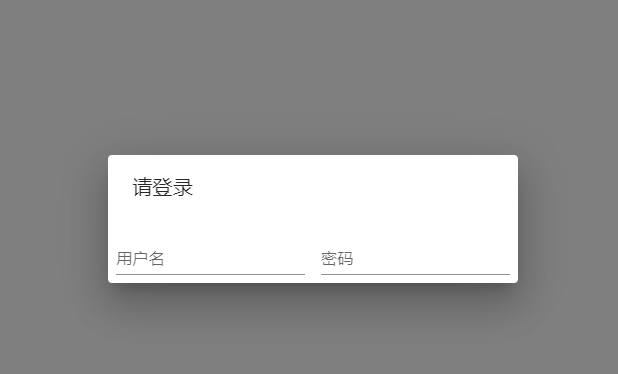
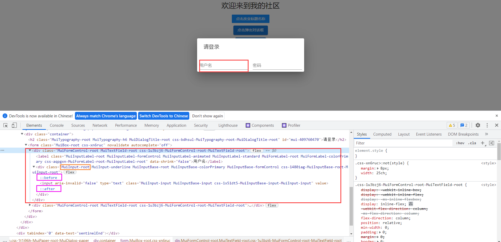
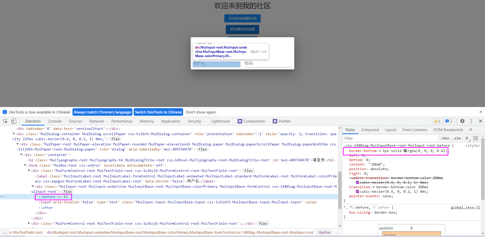
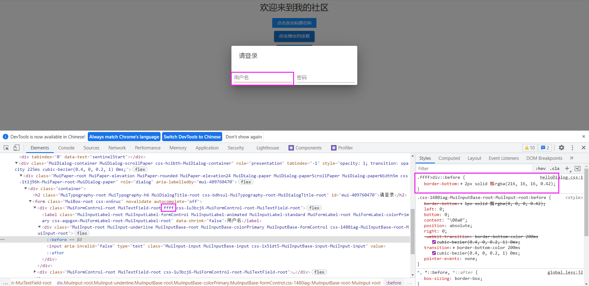
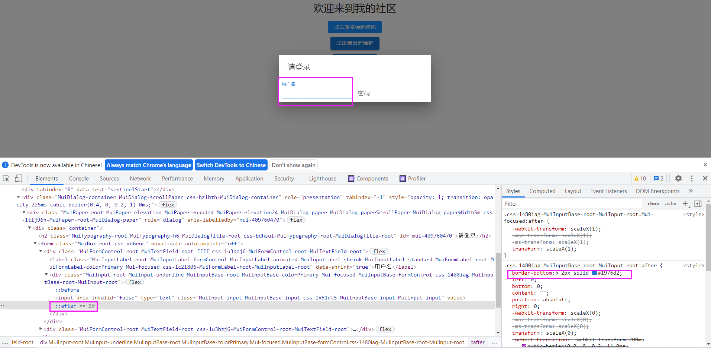
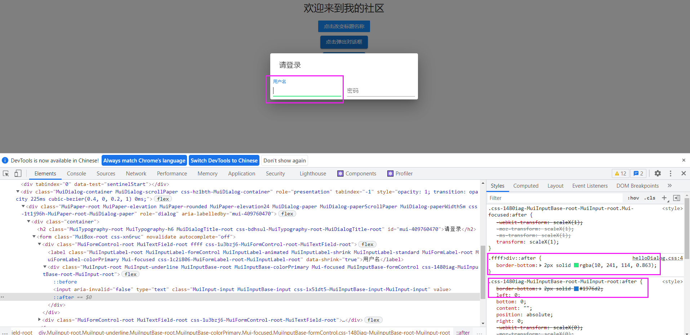
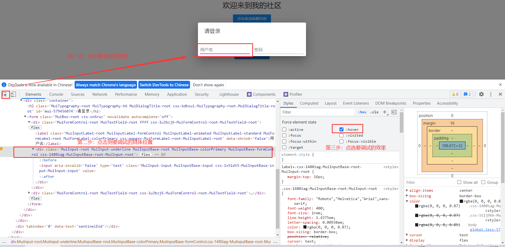
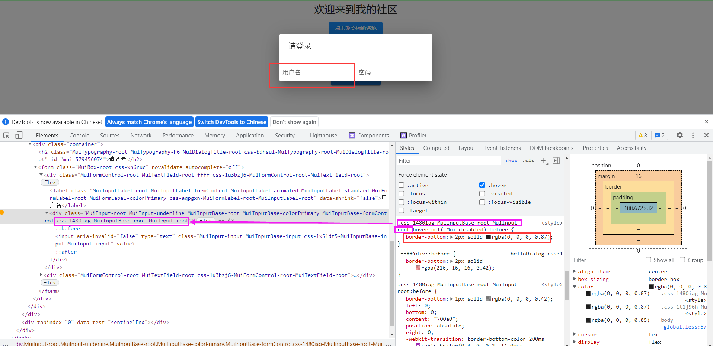
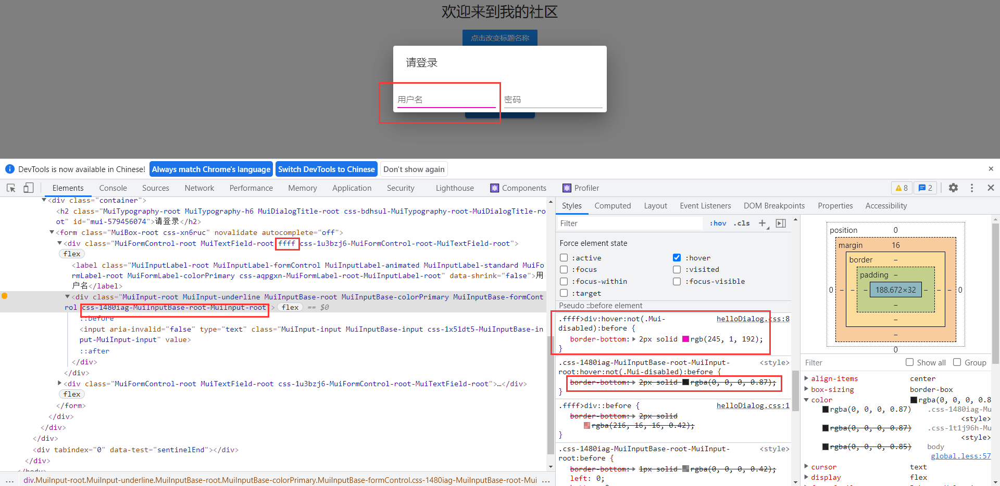

#  覆盖组件自带样式

## 文章简介

在组件化的前端页面中，我们一般会使用与我们应用的风格相近的组件库，但是我们仍然经常会需要去覆盖组件自带的样式为我们期望的风格，比如设置输入框的border颜色，而组件一般在渲染生成后往往不是一个简单的div，因此我们要覆盖样式真的是总是较劲脑汁，以下为我总结的一些比较有效的方法，希望分享给大家。

通常手段有以下3种：

## 1、内联样式：

内联样式是权重最高的覆盖，直接使用可以覆盖组件的自带样式，但是正式开发中较少使用；

## 2、外联样式文件：

使用css文件，定义类选择器或者id选择器等，去覆盖组件自带的样式，此时一般会需要在选择器中加入 `!important`来使样式强制生效；（`!important`是强制提高权重的一种手段）

## 3、特殊情况：

**3.1、子类选择器：**

在开发中会碰到特殊情况，导致前两种方法都不能正常工作；比如一个组件渲染出来后，里面通常包含有子组件，此时无法使用内联样式覆盖子组件的自带样式，也无法在子组件上添加类选择器，此时就可以通过[子类选择器](https://www.w3school.com.cn/css/css_selector_child.asp)`>`来将样式覆盖到子组件上。

**3.2、before与after选择器：**

[before](https://www.w3school.com.cn/cssref/selector_before.asp)与[after](https://www.w3school.com.cn/cssref/selector_after.asp)是一种可以在元素的内容前后插入内容或设置样式的选择器。很多组件自带的样式中使用这两个选择器做一些样式设置，如果我们需要覆盖这些样式，也是可以通过上述子类选择器的方式进行覆盖。

**3.3、示例：**

由于我是在使用React框架和Material-UI组件库，因此会使用Material-UI组件来举例，就算不熟悉也没有关系，css能看懂就行。

我会设置两个输入框（用户名和密码框），随后来覆盖它们的自带样式。

```jsx
<Dialog onClose={handleClose} open={open}>
  <div className="container">
    <DialogTitle>请登录</DialogTitle>
      <Box
        component="form"
        sx={{
          '& > :not(style)': { m: 1, width: '25ch' },
        }}
        noValidate
        autoComplete="off"
      >
        <TextField type="text" label="用户名" variant="standard" />
        <TextField type="password" label="密码" variant="standard" />
      </Box>
  </div>
</Dialog>
```



目前，有两个输入框如图，首先来覆盖用户名输入框的下划线样式，修改颜色为红色；虽然这个输入框自带color属性可以修改颜色，但是我们尝试通过子类选择器修改。F12打开控制台，可以发现，用户名输入框在代码中只是一个TextField标签，却渲染生成了一个外部div包裹一个内部lable和内部div的组合标签。



而下划线其实就是输入框div的下部轮廓，也正是如图样式，很明显是组件自带的类选择器设置的样式，于是通过我们描述的方法去修改，代码如下：



```css
/* 修改样式 */
.ffff>div::before {
    border-bottom: 2px solid rgba(216, 16, 16, 0.42);
}
```

```jsx
<TextField className="ffff" type="text" label="用户名" variant="standard" />
<TextField type="password" label="密码" variant="standard" />
```

在运行程序可以发现我们设置的样式已经生效了，如果没有生效可以使用`!important`提高权重，此外记得要引入你的css文件，否则无论如何也是不会生效的。



然后我们修改用户名框输入时的样式，原样式如下图：



跟之前同理，此时应修改after，我们将下划线颜色设置为绿色：

```css
.ffff>div::before {
    border-bottom: 2px solid rgba(216, 16, 16, 0.42);
}
.ffff>div::after {
    border-bottom: 2px solid rgba(16, 194, 96, 0.42);
}
```



很明显，原样式的类选择器下已经有了删除线，我们的样式已经将它覆盖掉了，可以对比密码框的样式效果。

## 4、调试hover样式：

最后我们要覆盖用户名输入框的hover样式：

如果不知道浏览器如何查看hover样式请看下图：（这个是我已经调好的）



首先，原本的hover样式如图：

我们已经找到是哪个自带的类选择器在设置hover属性，并找到对应的div，此时就可以通过我们之前的方法来覆盖hover样式：



```css
.ffff>div:hover:not(.Mui-disabled):before {
    border-bottom: 2px solid rgb(245, 1, 192);
}
```

设置之后再看浏览器，我们的样式已经覆盖掉自带的样式了：



## 以上

感谢您花时间阅读我的博客，若有不对之处，还望指正，期待与您交流。👏👏👏

想要下载笔记文档的同学请到[我的码云仓库](https://gitee.com/zhangqianchun/blog-park-blog-download)进行克隆下载。

本篇博文系原创，仅用于个人学习，转载请注明出处。👈👈👈


