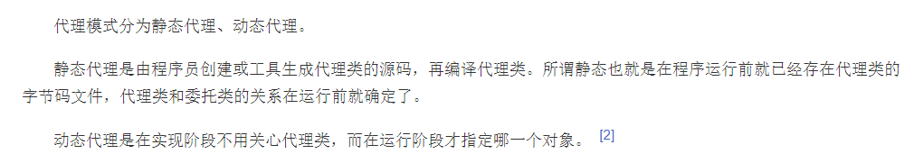
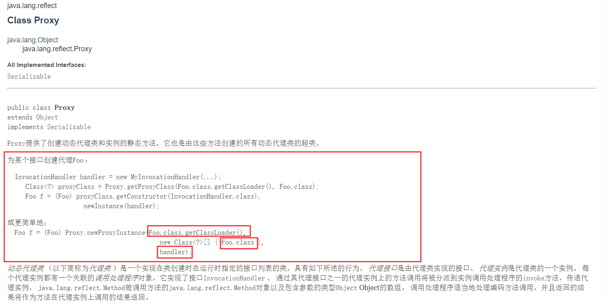

# 23天设计模式之代理模式

## 文章简介

《23天设计模式之代理模式》是在最近学习反射与注解时，在反射中有关Proxy类的知识，也就顺带复习一下代理模式，总结博客。

## 代理模式

- 为其他对象提供一种代理以控制对这个对象的访问。在某些情况下，一个对象不适合或者不能直接引用另一个对象，而代理对象可以在客户端和目标对象之间起到中介的作用。

- 组成：

  > - 抽象角色：通过接口或抽象类声明真实角色实现的业务方法。
  >
  > - 代理角色：实现抽象角色，是真实角色的代理，通过真实角色的业务逻辑方法来实现抽象方法，并可以附加自己的操作。
  >
  > - 真实角色：实现抽象角色，定义真实角色所要实现的业务逻辑，供代理角色调用。

- 举个例子：

  > -  比如 “租房子”、“租客”、“中介”就分别代表 “抽象角色”、“真实角色”、“代理角色”。
  > - “租客”与“中介”都要实现“租房子”接口。
  > - 将“租客”注入到“中介”中，由“中介”调用“租客”的实现方法。

- 代理分为静态代理和动态代理。

  > - 静态代理：手动生产代理类。
  > - 动态代理：自动生成代理类。
  >
  > 

### 静态代理

直接上代码：

- 抽象角色

```java
// 租房子 - 抽象角色，用接口或抽象类表示，里面放真实角色要实现的业务方法
public interface Rent {
    void rent();
}
```

- 真实角色

```java
// 租客 - 真实角色
public class Tenant implements Rent {

    private String name;

    public Tenant(String name) {
        this.name = name;
    }

    @Override
    public void rent() {
        System.out.println("租客：" + name + " 租到房子了");
    }
}
```

- 代理角色

```java
// 静态代理类 - 代理角色
public class StaticProxy implements Rent{

    // 将被代理角色注入进来
    private Tenant tenant;

    public void setTenant(Tenant tenant) {
        this.tenant = tenant;
    }

    public void beforeRent() {
        System.out.println("租房前，中介带租客看房");
    }

    public void afterRent() {
        System.out.println("租房后，中介收取中介费和房租");
    }

    @Override
    public void rent() {
        beforeRent();
        tenant.rent(); // 执行真实角色的代理方法，租房前后可以插入其它业务代码。
        afterRent();
    }
}
```

- 测试

```java
public class Test {

    public static void main(String[] args) {
        Tenant tenant = new Tenant("孤影");
        StaticProxy proxy = new StaticProxy();
        proxy.setTenant(tenant);
        proxy.rent(); // 可以发现，在这里已经是代理类在执行代理方法， 而不是Tenant类在执行
    }
}

// 输出
租房前，中介带租客看房
租客：孤影 租到房子了
租房后，中介收取中介费和房租
```

### 动态代理

- 动态代理分为两大类：基于接口的动态代理，基于类的动态代理。
  - 基于接口：jdk动态代理。
  - 基于类：cglib。
  - java字节码实现：javassist。
- 这里我们主要了解jdk动态代理。
- 面试时问道我们动态代理是怎么实现的？我们通常只是回答通过反射实现的，但是具体的却说不出东西来，因此一定了解Proxy类和InvocationHandler接口。




接下来上代码：

- 抽象角色和真实角色与上文相同。
- 定义一个InvocationHandler，以此来调用代理的方法。

```java
// 动态代理类处理程序 - 通过此类获取代理角色，得到代理类后，使用代理类执行代理方法
public class DynamicProxyHandler implements InvocationHandler {

    // 注入被代理对象
    private Object target;

    private String before;

    private String after;

    public void setTarget(Object target) {
        this.target = target;
    }

    public DynamicProxyHandler(String before, String after) {
        this.before = before;
        this.after = after;
    }

    // 生成代理角色
    public Object getProxy() {
        return Proxy.newProxyInstance(this.getClass().getClassLoader(), target.getClass().getInterfaces(), this);
    }

    public void beforeInvoke(String s) {
        System.out.println(s);
    }

    public void afterInvoke(String s) {
        System.out.println(s);
    }

    @Override
    public Object invoke(Object proxy, Method method, Object[] args) throws Throwable {
        beforeInvoke(before);
        Object result = method.invoke(target, args);// 通过反射执行代理方法，前后可插入其它业务代码
        afterInvoke(after);
        return result;
    }
}
```

- 测试

```java
public class Test {

    public static void main(String[] args) {
        Tenant tenant = new Tenant("孤影");
        DynamicProxyHandler handler = new DynamicProxyHandler("租房前，中介带租客看房", "租房后，中介收取中介费和房租");
        handler.setTarget(tenant);
        Object proxy = handler.getProxy();
        if (proxy instanceof Rent) { // 可以看到，生成的代理类仍然是抽象角色的一个实例
            ((Rent) proxy).rent();
        }
    }
}

// 输出
租房前，中介带租客看房
租客：孤影 租到房子了
租房后，中介收取中介费和房租
```

- 疑惑：

  > - 有同学可能会疑惑生成代理角色时使用的`this.getClass().getClassLoader()`，为什么不是`target.getClass().getClassLoader()`？
  >
  > - 其实二者获取的类加载器都是同一个AppClassLoader。
  >
  > - 通过打印测试确实是同一个类加载器：
  >
  >   ```java
  >   // 生成代理角色
  >   public Object getProxy() {
  >       System.out.println(this.getClass().getClassLoader());
  >       System.out.println(target.getClass().getClassLoader());
  >       return Proxy.newProxyInstance(this.getClass().getClassLoader(), target.getClass().getInterfaces(), this);
  >   }
  >   
  >   // 输出
  >   sun.misc.Launcher$AppClassLoader@18b4aac2
  >   sun.misc.Launcher$AppClassLoader@18b4aac2
  >   ```
  >
  > - 关于类加载器要了解更多请阅读我的[另一篇文章 - 简单谈谈对GC垃圾回收的通俗理解](https://www.cnblogs.com/guying-blog/articles/14637507.html)，关于类加载器和双亲委派机制讲的也比较详细。

### 动态代理的好处

- 可以使真实角色的操作更纯粹！不用去关注一些公共的业务。
- 公共业务就交给代理角色，实现了业务的分工。
- 公共业务发生扩展时，方便集中的管理。
- 一个动态代理类代理的是一个接口，一般就是对应一类业务。
- 一个动态代理类可以代理多个类，只要是实现了同一个接口即可。

## 以上

感谢您花时间阅读我的博客，以上就是我对代理模式的一些理解，若有不对之处，还望指正，期待与您交流。

本篇博文系原创，仅用于个人学习，转载请注明出处。