# 简单谈谈对GC垃圾回收的通俗理解

## 文章简介

《简单谈谈对GC垃圾回收的理解》是我的第一篇博客，了解并学习了JVM的垃圾回收机制后，把自己的一些理解记录下来，通过输出博客的方式来沉淀，我觉得是一个不错的方式！

## 垃圾回收是指什么

所谓的垃圾，顾名思义，就是指的在程序运行的过程中，有类的诞生、初始化、销毁，在这一系列的过程中，我们的程序自然会产生一些已经消亡的，不需要的类、实例等等。

而这些对于程序不需要的东西或者阻碍程序正常运行的东西就是垃圾。

而垃圾回收指的就是将这些垃圾从我们程序运行的环境中清除出去，至于这些垃圾会去向哪里，自然是不需要我们去关心的，毕竟你也从未关心过垃圾收集车🚗将垃圾运往何处！

## 为什么需要垃圾回收

我们都知道，小区的垃圾回收车🚗每天都会将垃圾集中运走处理，还小区一个干净舒适的环境。

那么同样，程序的运行也需要一个畅通无阻的环境。如果垃圾过多，可能导致程序运行时间变长，就像我们的电脑C盘空间不足的时候，电脑不仅运行缓慢，还会出现死机、蓝屏等恶况！

程序中比较经典的因为垃圾过多导致的错误就有==OOM==（java.lang.OutOfMemoryError）。

### OOM 内存不足

官方语言是这样描述的：当Java虚拟机由于内存不足而无法分配对象，并且垃圾回收器无法再提供更多内存时，抛出该异常。通俗来说，就是内存满了，爆了。

而我们知道，java中错误（Error）和异常（Exception）是不同的。异常还可以被捕获、抛出来通过程序代码来处理，但是错误已经严重到不足以被应用处理，会导致程序直接崩溃停止！在真实项目中这样的情况肯定是不允许发生的。

那么我们可以分析一下导致内存不足的原因！无外乎有以下两点：

- 分配到的内存太少。
- 程序使用的太多。

==分配太少==：我们知道，虚拟机可以使用的内存也是有个限度的，当被分配的内存大小完全不够支持我们程序正常运行就会OOM。我们可以通过以下代码查看JVM初始化的总内存大小和JVM试图使用的最大内存。

```java
long maxMemory = Runtime.getRuntime().maxMemory();//虚拟机试图使用的最大内存
long totalMemory = Runtime.getRuntime().totalMemory();//jvm初始化的总内存

System.out.println("maxMemory=" + maxMemory+"字节\t" + (maxMemory/(double)1024/1024) + "MB" );
System.out.println("totalMemory=" + totalMemory+"字节\t" + (totalMemory/(double)1024/1024) + "MB" );

```

在默认情况下，初始化的总内存约为我们电脑内存的`1/64`，试图使用的最大内存约为电脑内存的`1/4`。这里的计算误差可以自行了解。

而这个分配给虚拟机的内存其实是可以手动调节的。我们可以通过调节虚拟机参数来自定义分配内存大小。因此我们可以尝试去增大分配内存，测试程序是否仍然OOM！如果还是OOM那可能就需要去检查我们的代码是不是出问题了。

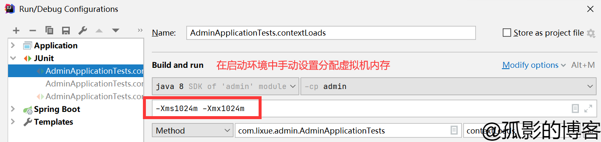

```java
-Xms4028m -Xmx4028m
```

==使用的太多==：意思就是本来分配的内存完全是足够程序正常运行的，但是由于某些错误的使用导致内存使用后没有及时释放，造成内存泄露或内存溢出。

- 内存泄露：（**memory leak**）指的是程序在申请内存后，无法释放已申请的内存空间，导致虚拟机无法将该块内存分配给其他程序使用。
- 内存溢出：（ **out of memory**）指的是程序申请的内存超出了JVM能提供的内存大小。

在之前没有垃圾自动回收的日子里，比如C语言和C++语言，我们必须亲自负责内存的申请与释放操作，如果申请了内存，用完后又忘记了释放，比如C++中的new了但是没有delete，那么就可能造成内存泄露。偶尔的内存泄露可能不会造成问题，而**大量的内存泄露可能会导致内存溢出**。

而在Java语言中，由于存在了垃圾自动回收机制，所以，我们一般不用去主动释放不用的对象所占的内存，也就是理论上来说，是不会存在“内存泄露”的。但是，如果编码不当，比如，将某个对象的引用放到了全局的Map中，虽然方法结束了，但是由于垃圾回收器会根据对象的引用情况来回收内存，导致该对象不能被及时的回收。如果该种情况出现次数多了，就会导致内存溢出，比如系统中经常使用的缓存机制。Java中的内存泄露，不同于C++中的忘了delete，往往是逻辑上的原因泄露。

在我们扩大了JVM内存后仍然OOM的话，就需要使用内存快照分析工具来快速定位内存泄漏。使用JProfiler来分析Dump出的内存文件。还是修改JVM的启动参数并导出内存文件，然后用JProfiler打开分析。

```java
-Xms10m -Xmx80m -XX:+HeapDumpOnOutOfMemoryError
```

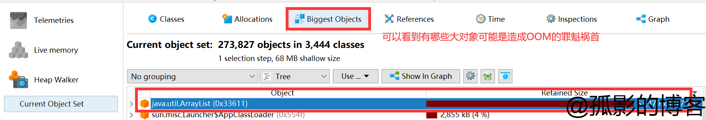

这样我们便能快速定位内存泄漏，并进行改进！

## 怎么进行垃圾回收

### 垃圾回收的地方

#### JVM的位置

垃圾回收的地方自然是在JVM中。因此，首先我们需要了解JVM在哪里？下面通过一张图展示JVM的位置。

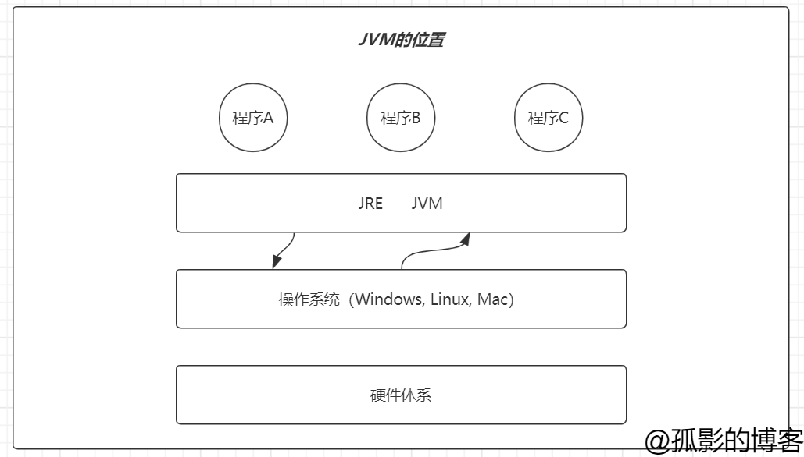

JVM与操作系统交互，而程序是在JVM上运行的。这里的JVM其实就是JRE，而不是JDK！

#### jvm的体系结构

那我们知道了JVM的位置，但是垃圾回收也并不是存在于JVM的所有角落的。因为JVM中也是划分为了好几块区域的，下面我们看看JVM中区域的划分。

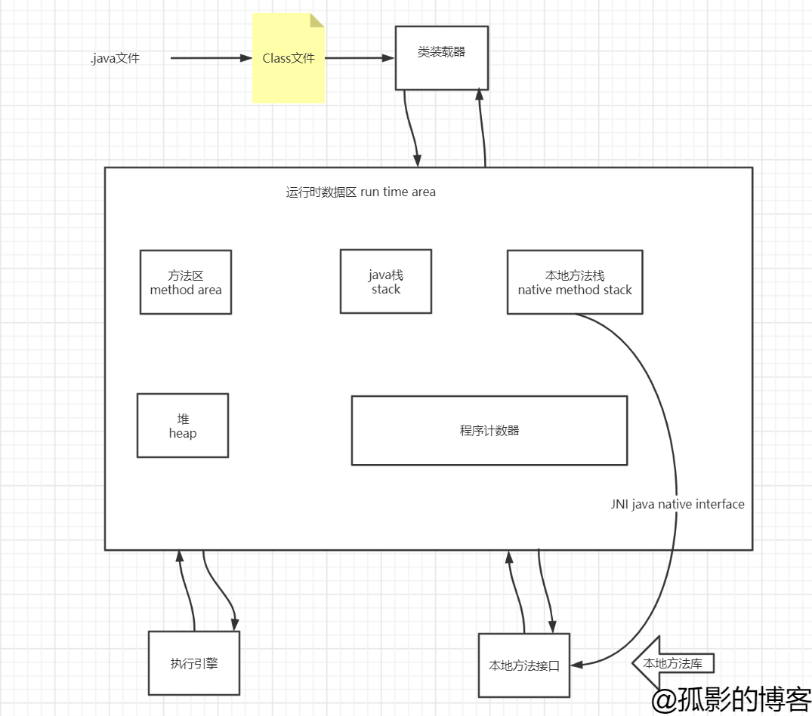

我们从上到下来分析一下JVM的体系结构。

##### 类加载器

顾名思义，类加载器就是用于加载一个类的。我们都知道，我们写的代码刚开始是一个`.java`文件，经过idea编译之后变成`.class`文件，最后通过类加载器加载成为一个Class，我们可以通过这一个Class，new出很多个实例对象。

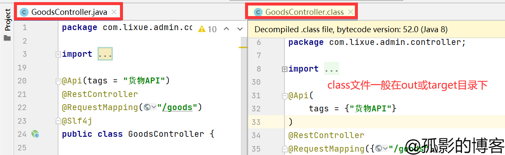

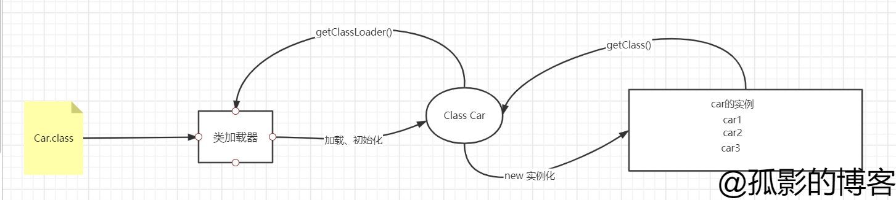

类加载器又分为以下：

1. 虚拟机自带的加载器。
2. 启动类加载器/根加载器 Bootstrap 位于\jdk_1.8\jre\lib\rt.jar下
3. 扩展程序加载器 ExtClassLoader 位于\jdk_1.8\jre\lib\ext下
4. 应用程序加载器/系统类加载器 AppClassLoader

既然有这么多ClassLoader，它们是从哪里加载class的，这个问题jdk源码中sun.misc.Launcher已经给出回答：Bootstrap ClassLoder加载的是System.getProperty("sun.boot.class.path");、ExtClassLoader加载的是System.getProperty("java.ext.dirs")、AppClassLoader加载的是System.getProperty("java.class.path")。

另外不得不了解的是==双亲委派机制==：

说白了就是需要加载一个类的时候，子加载器都特别懒，都想依靠父加载器，只有父加载器加载不了这个类的时候，子加载器才去加载。

> Java的类加载使用双亲委派模式，即一个类加载器在加载类时，先把这个请求委托给自己的父类加载器去执行，如果父类加载器还存在父类加载器，就继续向上委托，直到顶层的启动类加载器。如果父类加载器能够完成类加载，就成功返回，如果父类加载器无法完成加载，那么子加载器才会尝试自己去加载。

那么谁是父，谁是子？通过以下代码即可查看。

```java
car car1 = new car();
Class<? extends car> car1Class = car1.getClass();
System.out.println(car1Class.getClassLoader());//AppClassLoader
System.out.println(car1Class.getClassLoader().getParent());//ExtClassLoader 
System.out.println(car1Class.getClassLoader().getParent().getParent());//null 1.不存在 2.java程序找不到
```

AppClassLoader -------->ExtClassLoader-------->Bootstrap 由子到父。

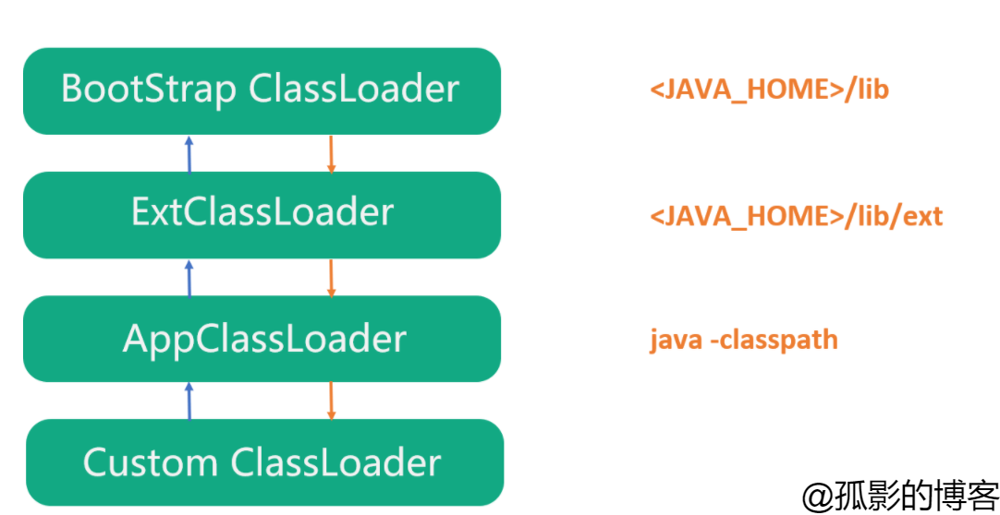

这种机制的好处：

- 避免类的重复加载。
- 防止java的核心API被篡改。即使我们定义了与java核心api相同的类，双亲委派机制也会引导去加载核心api。

举个例子：

- 自定义类：java.lang.String


与核心api重名，根据双亲委派机制，引导类会加载核心api中的String，忽略掉自定义String类，如果不采用该机制，那么自定义的String将有可能被加载，那将会导致非常崩溃的情况，比如功能无法实现，项目信息泄露等等。

- 自定义类：java.lang.MyClass


包名的命名与核心api包重合，那么理论上就会由引导类加载器完成加载，可是经过检验发现是没有权限访问核心包路径的，那么就会拒绝加载，避免对引导类加载器本身与核心包造成威胁。

类加载器了解这么多就差不多了。接下来看看运行时数据区。

##### 运行时数据区

这块区域里面会发生很多事情。变量的初始化、常量定义、对象实例化、方法调用等。在这一系列过程中产生垃圾是不可避免的。而我们一定要记住的是以下两块区域，有一块是不会产生垃圾的。

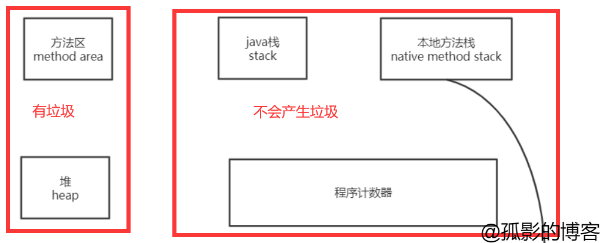

先说说==不会产生垃圾这一块区域==。

我们看到这一块区域有三部分组成：

- java栈
  - 栈是一种先进先出的数据结构。
  - 主要存储8大基本类型、对象引用、实例的方法。
  - 栈里面要使用的东西就会压栈，不使用的就会弹栈。其实就是进出栈。用完即弹出，所以不会产生垃圾。
  - 这里常问到的问题是main方法为何先调用却最后结束？以及java.lang.StackOverflowError 栈溢出。
- 本地方法栈
  - 这里主要用于登记带有native关键字修饰的本地方法。
  - 我们都知道Java是用C++写的，这里的native修饰的方法也是C++的本地方法库，Java通过JNI（本地方法接口）去调用C++的库方法，来实现Java不容易实现的功能。
- 程序计数器
  - 保存下一条将要执行的指令地址。也称PC寄存器。

再说说==有垃圾的这一块区域==。

我们看到这一块区域有两部分组成：

- 方法区：
  - 静态变量、常量、类信息（构造方法、接口定义）、运行时常量池存在方法区，但是实例变量存在堆内存中，和方法区无关。
  - 方法区是被所有线程共享的。
- 堆：
  - 类加载器读取了类文件之后，一般会把什么东西放到堆中？类、方法、常量、变量~，保存我们所有引用类型的真实对象。
  - 堆内存又分为三个区：新生区、养老区、永久区。
  - 之前所说的OOM就是指的堆内存不足。所谓的JVM调优也主要指堆内存调优。

关于这一块区域暂时先了解到这里，后面会更详细的说明这一块区域的信息。

#### 堆的三大区域

先看一张图：

如下，左边的元空间指永久区、中间的3小块指新生区，右边老年区也就是养老区。接下来详细看看这几个区的特性。

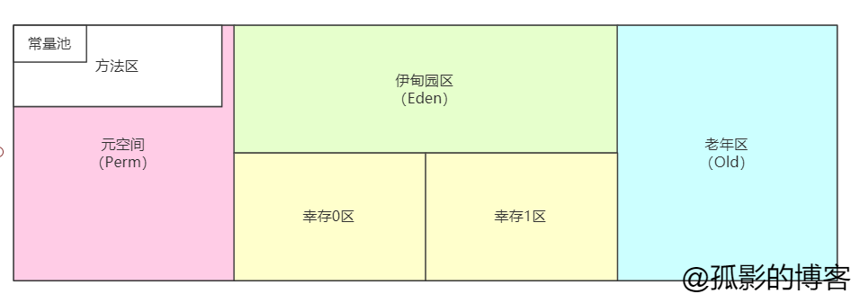

新生区：

- 类诞生、成长、甚至死亡的地方。
- 伊甸园区。所有的对象都是在伊甸园区new出来的。伊甸园区满了就会触发一次轻GC。幸存下来的会放到幸存者区。
- 幸存者区0、1。（也称from、to区）伊甸园区和幸存区都满了就会触发一次重GC。幸存下来的会放到老年区。（轻重GC先不理会）
- 真理：经过研究，99%的对象都是临时对象！所以很少OOM。

养老区：

- 大部分对象都是比较稳定，不容易消亡的对象。

元空间：

- 这个区域是常驻内存的。用来存放一些jdk自身携带的class对象和接口元数据。储存的是java运行时的一些环境和类信息，这个区域不存在垃圾回收，关闭VM虚拟就会释放这个区域的内存。
- 关于元空间和永久代的关系可以自行了解。

### 轻GC和重GC

#### 分类

- Minor GC

  - 轻GC

  - 清理年轻代。
  - Minor GC指新生代GC，即发生在新生代（包括Eden区和Survivor区）的垃圾回收操作，当新生代无法为新生对象分配内存空间的时候，会触发Minor GC。因为新生代中大多数对象的生命周期都很短，所以发生Minor GC的频率很高。

- Major GC

  - 轻GC

  - 清理老年代。
  - Major GC清理Tenured区，用于回收老年代，出现Major GC通常会出现至少一次Minor GC。

- Full GC

  - 重GC

  - 清理整个堆空间—包括年轻代、老年代、元空间。
  - Full GC是针对整个新生代、老生代、元空间（metaspace，java8以上版本取代perm gen）的全局范围的GC。Full GC不等于Major GC，也不等于Minor GC+Major GC，发生Full GC需要看使用了什么垃圾收集器组合，才能解释是什么样的垃圾回收。

#### 分别触发的条件

Minor GC:

1. Eden区域满。
2. 新创建的对象大小 > Eden所剩空间。

Full GC:

1. 每次晋升到老年代的对象平均大小>老年代剩余空间。
2. MinorGC后存活的对象超过了老年代剩余空间。
3. 永久代空间不足。
4. 手动调用System.gc()

### GC回收算法

在堆中存放着对象实例，GC回收器在对堆进行回收前，需要确定哪些对象需要被回收，即确定哪些对象还存活，哪些对象已经死去。而GC算法正是起这种作用的。

#### 种类

- 标记清除法。
- 标记压缩。
- 复制算法。
- 引用计数器。（已经不再使用）

#### 引用计数器

给对象添加一个引用计数器，每当一个地方引用它时，计数器加1，每当引用失效时，计数器减少1.当计数器的数值为0时，也就是对象无法被引用时，表明对象不可在使用，这种方法实现简单，效率较高，大部分情况下不失为一个有效的方法。但是主流的Java虚拟机如HotSpot并   没有选取引用计数法 来回收内存，主要的原因难以解决对象之间的相互循环引用的问题。

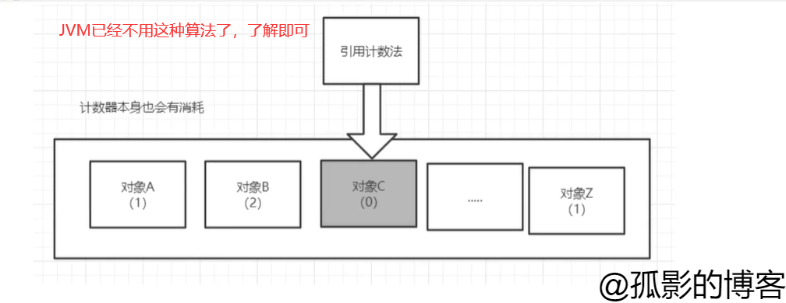

#### 标记清除法

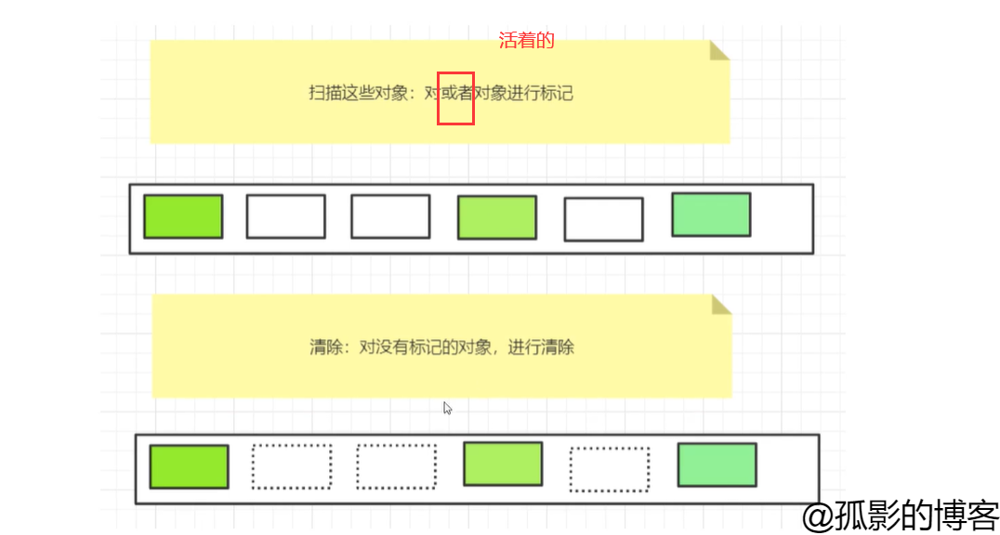

- 缺点：两次扫描严重浪费时间，会产生内存碎片。
- 优点：不需要额外的空间。

#### 标记压缩

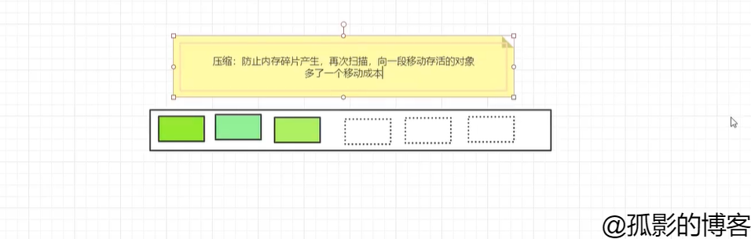

#### 复制算法

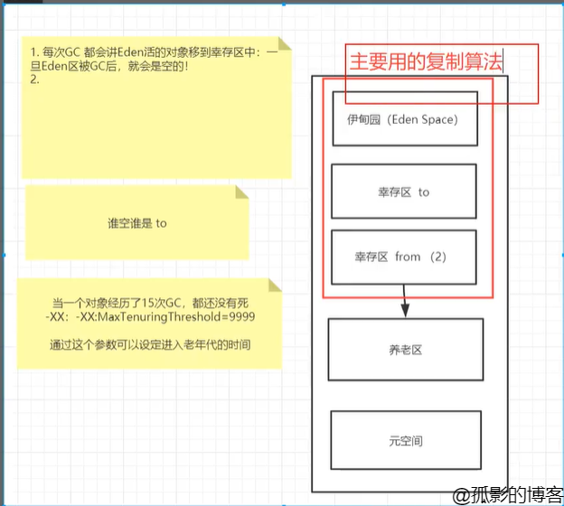

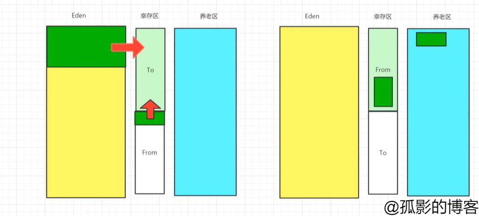

- 好处：没有内存碎片
- 坏处：浪费了内存空间。多一半空间永远是空 to。
- 复制算法最佳使用场景：对象存活度较低的时候。

#### 总结

- 内存效率：复制算法>标记清除算法>标记压缩算法 （时间复杂度）
- 内存整齐度：复制算法=标记压缩>标记清除算法
- 内存利用率：标记压缩算法=标记清除算法>复制算法

思考一个问题：难道没有最优算法吗？

没有。没有最好的算法，只有最合适的。GC也被称为**==分代收集算法==**。

年轻代：

- 存活率低 - 复制算法。

老年代：

- 区域大，存活率高 - 标记清除和标记压缩混合实现。


## 以上

感谢您花时间阅读我的博客，以上就是我对GC垃圾回收的一些理解，若有不对之处，还望指正，期待与您交流。

本篇博文系原创，仅用于个人学习，转载请注明出处。


