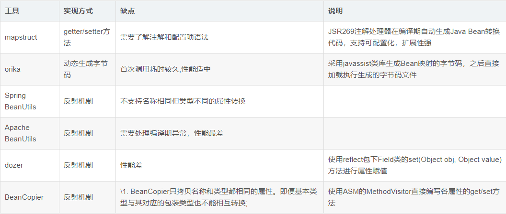

# Orika

## 前言

类复制工具有很多，比较常用的有 mapstruct、Spring BeanUtils、Apache BeanUtils、dozer 等，目前我所在的项目组中使用的是 mapstruct。在性能方面，mapstruct 毫无疑问是最优秀的，因为 mapstruct 是通过 getter、setter 方法来复制属性值的，而其它框架或多或少使用反射进行复制，这里也不再赘述。但是，mapstruct 也有它的不足之处，请看下面：

不知道大家使用 mapstruct 时，是否编写过类似如下的 java 表达式：

```java
@Mapper
public interface SmsTemplateConverter {

    SmsTemplateConverter SMS_TEMPLATE_CONVERTER = Mappers.getMapper(SmsTemplateConverter.class);

    @Mappings({
            // 这里只能通过全类名来调用静态方法，否则类无法注入到编译后的文件
            @Mapping(target = "templateType", expression = "java(org.example.enums.SmsEnum.getTypeByCode(platformTemp.getTemplateType()))")
    })
    SmsCompanyTemplateVO toSmsCompanyTemplateVO(SmsCompanyTemplate companyTemp, SmsPlatformTemplate platformTemp);
}
```

我们不难发现，一旦这里的 `org.example.enums.SmsEnum` 全类名目录发生改变，此处的代码就会报错，因为这里的 expression 是字符串，在目录更改时，不能自动更改全类名路径（因为是字符串，不是真正的 java 代码，mapstruct 的 java 表达式是由代码生成器生成的，在编译后 target 目录下可以看到），等于是写死的，后期维护和扩展时会比较困难，因此我们项目中决定放弃 mapsruct。

在调研了众多类复制工具后，我选择了 Orika，并通过 demo 验证确实可行，在了解 Orika 前，不妨了解一下各个类复制工具的对比，如下图示：（图片源于网络，如有侵权，请联系删除）



## 使用示例

下面我会以一个基本示例和一个Date属性转String属性的示例来示范 Orika 的使用。

### 导入依赖

```xml
<!-- 类复制工具：orika -->
<dependency>
    <groupId>ma.glasnost.orika</groupId>
    <artifactId>orika-core</artifactId>
    <version>1.5.2</version><!-- or latest version -->
</dependency>

<!-- hu-tool 工具包 -->
<dependency>
    <groupId>cn.hutool</groupId>
    <artifactId>hutool-all</artifactId>
    <version>5.7.16</version>
</dependency>

<!-- lombok -->
<dependency>
    <groupId>org.projectlombok</groupId>
    <artifactId>lombok</artifactId>
    <version>RELEASE</version>
    <scope>compile</scope>
</dependency>
```

### 定义实体 Person 和 PersonDTO

Person实体：

```java
import lombok.Data;
import java.util.Date;

@Data
public class Person {
    private String name; // 注意这个字段名是与 PersonDTO 相同的
    private String age;
    private Date birth;
}
```

PersonDTO实体：

```java
import lombok.Data;

@Data
public class PersonDTO {
    private String name;
    private Integer dtoAge;
    private String dtoBirth;
}
```

### 基本示例

简单用法一：

```java
import ma.glasnost.orika.MapperFacade;
import ma.glasnost.orika.MapperFactory;
import ma.glasnost.orika.impl.DefaultMapperFactory;
import org.example.entity.Person;
import org.example.entity.PersonDTO;

// MapperFacade
public class MapperFacadeMain {
    public static void main(String[] args) {
        MapperFactory mapperFactory = new DefaultMapperFactory.Builder().build();
        mapperFactory.classMap(Person.class, PersonDTO.class)
                .field("age", "dtoAge") // 属性名不同时的处理
                .byDefault() // 未列举的属性自动匹配
                .register();
        Person person = new Person();
        person.setAge("123"); // 字符串与数字可以互转
        person.setName("张三");
        MapperFacade mapper = mapperFactory.getMapperFacade(); // MapperFacade 的性能不如 BoundMapperFacade
        PersonDTO personDTO = mapper.map(person, PersonDTO.class);
        System.out.println(personDTO);
    }
}

// 输出 PersonDTO(name=张三, dtoAge=123, dtoBirth=null)
```

简单用法二：

```java
import ma.glasnost.orika.BoundMapperFacade;
import ma.glasnost.orika.MapperFactory;
import ma.glasnost.orika.impl.DefaultMapperFactory;
import org.example.entity.Person;
import org.example.entity.PersonDTO;

public class BoundMapperFacadeMain {
    public static void main(String[] args) {
        MapperFactory mapperFactory = new DefaultMapperFactory.Builder().build();
        mapperFactory.classMap(Person.class, PersonDTO.class)
                .field("age", "dtoAge")
                .byDefault()
                .register();
        Person person = new Person();
        person.setAge("456");
        person.setName("李四");
        BoundMapperFacade<Person, PersonDTO> boundMapper =
                mapperFactory.getMapperFacade(Person.class, PersonDTO.class);
        PersonDTO personDTO = boundMapper.map(person);
        System.out.println(personDTO);
    }
}

// 输出 PersonDTO(name=李四, dtoAge=456, dtoBirth=null)
```

### Date 转 String 示例

定义 converter：

```java
import cn.hutool.core.date.DateTime;
import ma.glasnost.orika.CustomConverter;
import ma.glasnost.orika.MappingContext;
import ma.glasnost.orika.metadata.Type;
import java.util.Date;

public class DateConverter extends CustomConverter<Date,String> {

    @Override
    public String convert(Date date, Type<? extends String> type, MappingContext mappingContext) {
        DateTime time = DateTime.of(date);
        return time.toString("yyyy-MM-dd HH:mm:ss");
    }
}
```

主函数：

```java
import ma.glasnost.orika.BoundMapperFacade;
import ma.glasnost.orika.MapperFactory;
import ma.glasnost.orika.converter.ConverterFactory;
import ma.glasnost.orika.impl.DefaultMapperFactory;
import org.example.converter.DateConverter;
import org.example.entity.Person;
import org.example.entity.PersonDTO;
import java.util.Date;

public class ConverterMain {
    public static void main(String[] args) {
        MapperFactory mapperFactory = new DefaultMapperFactory.Builder().build();
        ConverterFactory converterFactory = mapperFactory.getConverterFactory(); // 注册 converter
        converterFactory.registerConverter("DateConverterId", new DateConverter()); // 这里给 DateConverter 设置一个 id 为 DateConverterId,如果不设置,则为全局注册
        mapperFactory.classMap(Person.class, PersonDTO.class)
                .field("age", "dtoAge")
                .fieldMap("birth", "dtoBirth").converter("DateConverterId").add()
                .byDefault()
                .register();
        Person person = new Person();
        person.setAge("789");
        person.setName("王五");
        person.setBirth(new Date()); // 设置 Date
        BoundMapperFacade<Person, PersonDTO> boundMapper =
                mapperFactory.getMapperFacade(Person.class, PersonDTO.class);
        PersonDTO personDTO = boundMapper.map(person);
        System.out.println(personDTO);
    }
}

// 输出 PersonDTO(name=王五, dtoAge=789, dtoBirth=2021-11-29 20:34:21)
```

此时可以发现，自定义的转换器已经生效。

## 小结

不难发现，上面的 MapperFactory 在实际的项目开发中，应该定义为单例，由全局来共享一个 MapperFactory，官方文档中也有相关说明，感兴趣可以查看文档，以上就是有关 Orika 的分享，欢迎交流，共同进步。

## 更多用法

更多用法请参考官方文档：

文档地址：http://orika-mapper.github.io/orika-docs/index.html

Github：https://github.com/orika-mapper?language=html

## 笔记下载

此文章系原创，转载请附上链接，抱拳。

此文档提供 markdown 源文件下载，请去我的码云仓库进行下载。  [下载文档](https://gitee.com/zhangqianchun/Share)

若本文对你有用，请不要忘记给我的点个 Star 哦！


