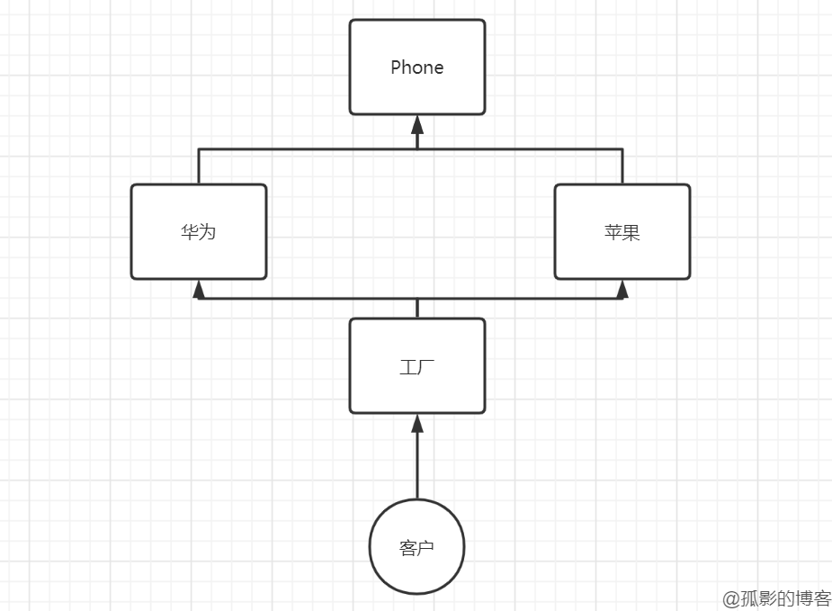
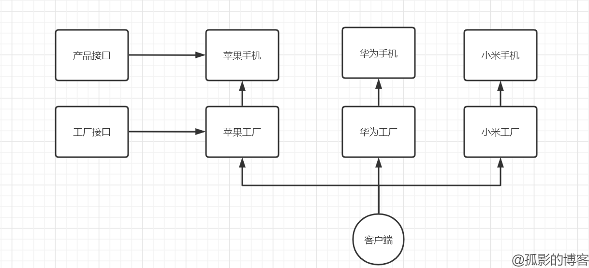

# 23天设计模式之工厂模式

## 文章简介

《23天设计模式之工厂模式》这是我的第三篇博客，继续昨天的单例模式，今天我们来了解一下工厂模式。顺便提一句，学习设计模式可能会有一种笼统的感觉，我们可以多去[画一下模型图](https://www.processon.com/)来加深映像。

## 工厂模式

- 通俗来说，如果用户需要获取对象，就直接去对象工厂拿，而创建对象就交给工厂做，用户不关心对象是如何创建的。因此用户不会去new对象。
- 分为简单工厂、工厂方法模式。

### 简单工厂

- 也称静态工厂。
- 用来生产同一结构等级中的任意产品。
- 缺点是增加新产品需要修改原有代码。==不符合开闭原则==。
- 不符合设计原则，却使用最多。



直接上代码：

```java
//产品接口
public interface Phone {
    void call();
}
```

```java
//苹果
public class Apple implements Phone{
    @Override
    public void call() {
        System.out.println("苹果手机打电话");
    }
}

public class HuaWei implements Phone{
    @Override
    public void call() {
        System.out.println("华为手机打电话");
    }
}
```

```java
//华为
public class SimpleFactory {
    //静态工厂--我们新增产品，肯定要修改这一块的代码
    public static Phone getPhone(String phoneName){
        if ("华为".equals(phoneName)) {
            return new HuaWei();
        } else if ("苹果".equals(phoneName)) {
            return new Apple();
        } else {
            System.out.println("没有该品牌手机");
            return null;
        }
    }
}
```

```java
//客户端
public class Client {
    public static void main(String[] args) {
        Phone phone = SimpleFactory.getPhone("苹果");
        phone.call();
    }
}
```

### 工厂方法

- 工厂方法是要在不修改原有代码的条件下，可以支持新增其他同等级的产品。比如已有华为、苹果手机，要新增一个小米手机，且不能修改原有的代码。
- 思路是：每个产品都有自己的工厂，苹果手机去苹果工厂拿，华为手机就找华为工厂，这就像是专卖店一样，消费者什么牌子的手机就去什么专卖店。
- 显而易见的缺点：如果产品种类少还好，一旦产品种类很多，那么我们要添加的代码量就会很大，这也是为什么简单工厂模式在实际的开发中反而更实用。这一点我们在代码中来体现。



```java
//产品接口
public interface Phone {
    void call();
}
```

```java
//产品
public class Apple implements Phone {
    @Override
    public void call() {
        System.out.println("苹果手机打电话");
    }
}

public class HuaWei implements Phone {
    @Override
    public void call() {
        System.out.println("华为手机打电话");
    }
}

public class XiaoMi implements Phone{
    @Override
    public void call() {
        System.out.println("小米手机打电话");
    }
}
```

```java
//工厂接口
public interface PhoneFactory {
    Phone getPhone();
}
```

```java
//工厂
public class AppleFactory implements PhoneFactory {
    @Override
    public Phone getPhone() {
        return new Apple();
    }
}

public class HuaWeiFactory implements PhoneFactory {
    @Override
    public Phone getPhone() {
        return new HuaWei();
    }
}

public class XiaoMiFactory implements PhoneFactory {
    @Override
    public Phone getPhone() {
        return new XiaoMi();
    }
}
```

```java
//客户端
public class Client {
    public static void main(String[] args) {
        //这些工厂就是一家家专卖店
        AppleFactory appleFactory = new AppleFactory();
        HuaWeiFactory huaWeiFactory = new HuaWeiFactory();
        XiaoMiFactory xiaoMiFactory = new XiaoMiFactory();

        //用户决定去哪家专卖店就调用谁的方法
        Phone phone = xiaoMiFactory.getPhone();
        phone.call();
    }
}
```

### 简单工厂和工厂方法模式对比

- 结构复杂度：简单工厂胜。
- 代码复杂度：简单工厂胜。
- 编程复杂度：简单工厂胜。
- 管理上的复杂度：简单工厂胜。
- ==根据设计原则==：==选择工厂方法模式==。
- ==根据实际业务==：==选择简单工厂模式==。

## 以上

感谢您花时间阅读我的博客，以上就是我对工厂模式的一些理解，若有不对之处，还望指正，期待与您交流。

本篇博文系原创，仅用于个人学习，转载请注明出处。