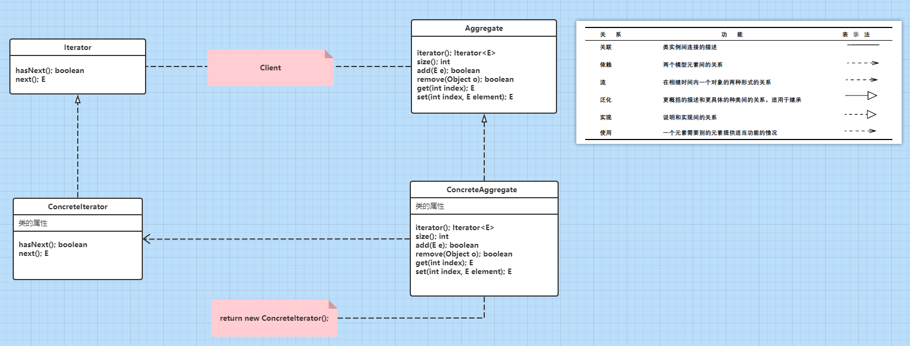
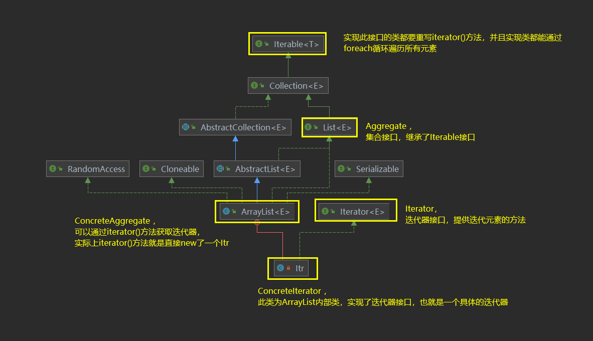

# 23天设计模式之迭代器模式

## 文章简介

今天在看Vector类的源码时发现集合基本上都使用到了迭代器模式，去了解了迭代器模式的相关知识，于是就有了这篇文章！在文章中我会拿我们最熟悉的ArrayList类来举例，对应迭代器中的几种角色一一阐释清楚。废话不多说，文章献上。

## 是什么

迭代器模式（Iterator），提供一种方法顺序访问一个聚合对象中的各种元素，而又不暴露该对象的内部表示。简单来说就是提供了对集合等聚合结构的遍历所有元素的方法。

对象的内部表示指的是什么？这个我暂时也不清楚。不过我理解的大体意思是指，用户不用关心这个集合中元素是怎么排列的，用户只需要通过这个接口就能依次拿到所有元素。

## 作用

1. 访问一个聚合对象的内容而无需暴露它的内部表示
2. 支持对聚合对象的多种遍历
3. 为遍历不同的聚合结构提供一个统一的接口

当然，上述几个概念都是从百度百科看来的，都比较容易理解，我也就不再一一解释了。

## 角色

1. Iterator（迭代器接口）：迭代器定义访问和遍历元素的接口。
2. ConcreteIterator （具体迭代器）：实现迭代器接口，真正地实现迭代元素。
3. Aggregate （聚合接口）：创建相应迭代器对象的接口，比如 `List<E> `接口。
4. ConcreteAggregate （具体聚合）：实现聚合接口，并提供一个方法返回一个具体迭代器。比如 `ArrayList<E>`。

角色之间的关系图示：（配色可还行:smile:）



> **下面来找找ArrayList类中对应的上述几个角色。**

图示如下：(idea中可以显示diagram图，可以去鼓捣鼓捣:laughing:)

这样一来就很清楚角色之间的关系了。



接下来我们再看看ArrayList的源码中，上述角色的体现。

```java
// 写一个测试类调用iterator()方法
public class Test {
    public static void main(String[] args) {
        ArrayList<String> list = new ArrayList<>();
        // 按住Ctrl+左键点击iterator()查看它的实现
        Iterator<String> iterator = list.iterator();
    }
}

// 发现list.iterator();调用的是ArrayList的iterator()方法
public class ArrayList<E> extends AbstractList<E>
        implements List<E>, RandomAccess, Cloneable, java.io.Serializable
{
    public Iterator<E> iterator() {
        // 该方法直接构造了一个Itr对象，说明Itr也是一个迭代器，再往下看Itr类
        return new Itr();
    }
    
    // Itr类是一个ArrayList的内部类，并且实现了迭代器接口，也就是一个具体的迭代器对象，就是上述的 ConcreteIterator 
    private class Itr implements Iterator<E> {
        int cursor;       // index of next element to return
        int lastRet = -1; // index of last element returned; -1 if no such
        int expectedModCount = modCount;

        Itr() {}    
```

```java
// 再回到上面看ArrayList，它实现了List接口，List接口又继承了Collection<E>接口
public interface List<E> extends Collection<E> {
    // List接口也有iterator()方法，说明ArrayList的iterator()方法就是实现List后的来的
    Iterator<E> iterator();
    
// 再看Collection接口，继承了Iterable接口
public interface Collection<E> extends Iterable<E> {
    Iterator<E> iterator();
    
// Iterable接口就是顶层接口了，它提供了3个方法，常用的是前两个方法
public interface Iterable<T> {
    
    // 因此，Collection下的所有集合的迭代器都是重写此方法获得的
    Iterator<T> iterator();
    
    // Collection下的所有集合都能使用foreach方法也是从这里来的
    default void forEach(Consumer<? super T> action) {
        Objects.requireNonNull(action);
        for (T t : this) {
            action.accept(t);
        }
    }
    
    default Spliterator<T> spliterator() {
        return Spliterators.spliteratorUnknownSize(iterator(), 0);
    }
```

## 自定义实现倒序输出的迭代器

接下来，我们通过自己定义四种角色来完成==倒序输出==的迭代器模式。(实战一波:blush:)

- 定义抽象接口，包含返回迭代器的方法

```java
public interface MyIterable<T> {
    MyIterator<T> iterator();
}
```

- 定义抽象迭代器

```java
public interface MyIterator<E> {
    boolean hasNext();
    E next();
}
```

- 定义聚合接口

```java
public interface MyList<E> extends MyIterable<E> {

    @Override
    MyIterator<E> iterator();

    int size();

    boolean add(E e);
}
```

- 实现聚合接口，并定义具体迭代器内部类

```java
// 这个类是参考Vector类写的, 只写了add方法和size方法
public class MyInvertedList<E> implements MyList<E> {

    protected Object[] elementData;

    protected int initialCapacity;

    protected int increment;

    protected int elementCount;

    public MyInvertedList(int initialCapacity, int increment) {
        if (initialCapacity < 0)
            throw new IllegalArgumentException("Illegal Capacity: "+
                    initialCapacity);
        if (increment < 0)
            throw new IllegalArgumentException("Illegal increment: "+
                    increment);
        this.initialCapacity = initialCapacity;
        this.increment = increment;
        this.elementData = new Object[initialCapacity];
    }

    // size是元素的个数而不是数组的长度
    @Override
    public int size() {
        return elementCount;
    }

    @Override
    public boolean add(E e) {
        if (elementData.length == elementCount) {
            // 添加时超出数组长度时自动扩容
            elementData = Arrays.copyOf(elementData, elementData.length + increment);
        }
        elementData[elementCount++] = e;
        return true;
    }

    @Override
    public MyIterator<E> iterator() {
        return new InvertedIterator();
    }

    // 使用内部类的好处是可以直接拿到this对象
    private class InvertedIterator implements MyIterator<E> {

        // 因为我们要倒叙输出，所以index是从后往前，而不是从0往后
        int index = elementCount;

        @Override
        public boolean hasNext() {
            return index > 0;
        }

        @Override
        public E next() {
            index--;
            return (E) elementData[index];
        }
    }
}
```

- 测试，使用迭代器倒序输出元素

```java
public class Test {
    public static void main(String[] args) {
        MyList<String> list = new MyInvertedList<>(5, 1);
        list.add("111");
        list.add("111");
        list.add("222");
        list.add("333");
        list.add("444");
        System.out.println("扩容前 size：" + list.size());
        list.add("555");
        list.add("666");
        System.out.println("扩容后 size：" + list.size());
        MyIterator<String> iterator = list.iterator();
        // 倒序输出
        while (iterator.hasNext()) {
            System.out.println(iterator.next());
        }
    }
}

// 输出
扩容前 size：5
扩容后 size：7
666
555
444
333
222
111
111
```

## 小结

可以说，迭代器模式是最常用的设计模式了，在元素遍历的地方基本上都能使用到迭代器模式。

完结撒花！！！:clap::clap::clap:

## 以上

感谢您花时间阅读我的博客，以上就是我对迭代器模式的一些理解，若有不对之处，还望指正，期待与您交流。

本篇博文系原创，仅用于个人学习，[转载](https://home.cnblogs.com/u/guying-blog/)请注明出处。:point_left::point_left::point_left: